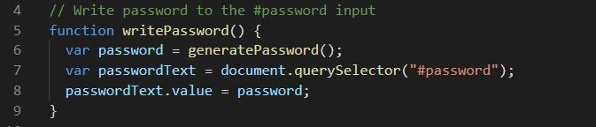
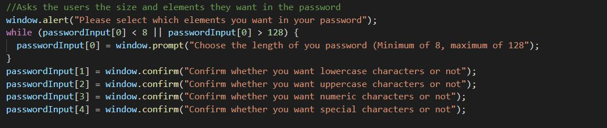
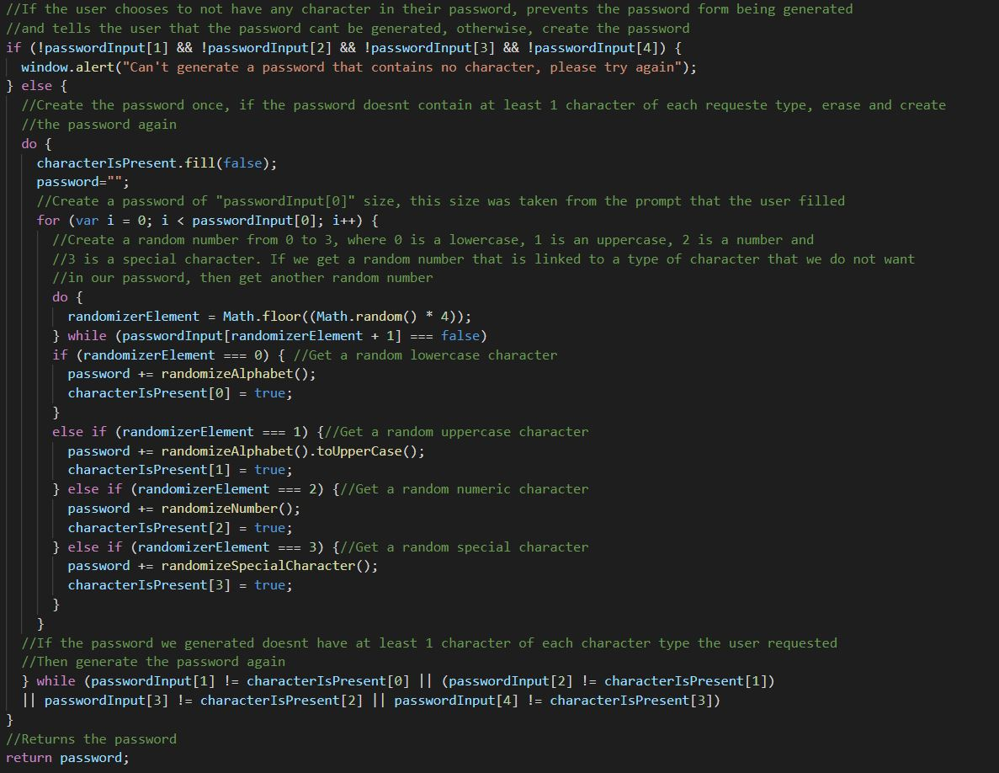
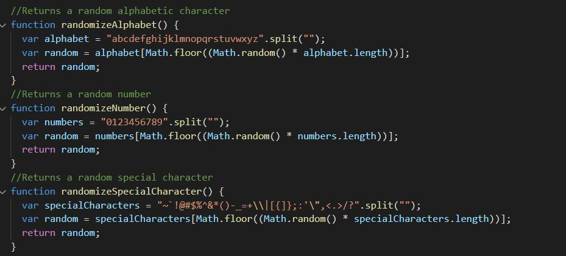

# HW3-PasswordGenerator

The purpose of this activity was to get a simple but realistic approach of how a user can interact with a webpage by asking the user for some preferences and creating a password that taked into account those inputs. 

The task consisted in modifying an existin webpage that had both the html and css files already developed but was missing the interactivity that can be achieved with javascript. The challenge involved getting the following information from the user and then creating a password with those requirements:

* Asking the user how many characters he wants in his password
* Asking wheter he wants or not lowercase characters in his password
* Asking wheter he wants or not uppercase characters in his password
* Asking wheter he wants or not numbers in his password
* Asking wheter he wants or not special characters in his password

After creating the password, the information was then supposed to be displayed on the webpage.

## Technologies

This project was developed using:
* CSS3
* HTML5
* JavaScript

## Setup

To run this project clone this repository in a folder and open the html file, there is also a deployed webpage that shows the final version of the project, you can access it by opening the link at the end of this file

## Development process

This activity consisted in implemenenting window alerts, prompts and confirms that allowed the code to get some data from the user and then return a password with said requirements.

The code was segmented into three pieces. The first one kept track of where the password was going to be displayed and was once the password was built, it was also in charge of displaying the password.

The second one was in charge of asking the user for their requirements, making sure that the requirements met the minimum criteria to be able to create a password and storing the characters that were randomly generated

The last one was in charge of creating a single random character that was going to be added to the password.

|   |
| ------------- |
|Sample #1 code - Keeping track of password display area|

&nbsp;

|   | 
| ------------- |
| Sample #2 code - Asking the user for requirements |

&nbsp;

|   | 
| ------------- |
| Sample #3 code - Password generator logic |

&nbsp;

|   | 
| ------------- |
| Sample #4 code - Character randomizer logic |

&nbsp;

## Deployed webpage:
* https://erickcc.github.io/HW3-PasswordGenerator/
